# GitLab CI/CD Lab Guide with Visual Studio Code

## Project Overview

This project demonstrates the implementation of Continuous Integration and Continuous Deployment (CI/CD) using *GitLab CI/CD* with *Visual Studio Code (VS Code)* as the primary development environment.

The lab covers the complete lifecycle of creating a GitLab repository, configuring GitLab CI/CD pipelines, executing multiple pipeline jobs, managing secure CI/CD variables, creating build artifacts, and validating successful pipeline execution.

The purpose of this project is to gain practical experience in automating software development workflows while following DevOps best practices. Throughout the project, GitLab Pipelines were used to automate build, test, and deployment stages, reducing manual effort and improving consistency.

---

# Objectives

The objectives of this project are to:

- Understand the fundamentals of GitLab CI/CD.
- Create and configure GitLab CI/CD pipelines.
- Automate software build, test, and deployment processes.
- Implement multiple jobs within a single pipeline.
- Secure sensitive information using GitLab CI/CD Variables.
- Preserve build outputs using GitLab Artifacts.
- Execute and monitor pipelines successfully.
- Document the implementation using professional Markdown documentation.

---

# Prerequisites

Before beginning this project, the following requirements were met:

- GitLab Account
- Git Installed
- Visual Studio Code
- Internet Connection
- Basic understanding of Git commands
- Windows Operating System

---

# Technologies Used

| Technology | Purpose |
|------------|----------|
| GitLab | Repository Hosting & CI/CD |
| Git | Version Control |
| Visual Studio Code | Code Editor |
| GitLab Runner | Pipeline Execution |
| YAML | Pipeline Configuration Language |
| Markdown | Documentation |


---

# Step 1: Creating a GitLab Repository

## Purpose

The first stage of every CI/CD project is establishing a centralized version control repository where source code, configuration files, documentation, and pipeline definitions are stored.

GitLab serves as both a Git repository manager and a complete DevOps platform. Creating the repository provides a secure location for storing project files while enabling GitLab CI/CD to automatically detect repository changes and execute pipelines whenever new commits are pushed.

Initializing the repository with a `README.md` file creates the default branch and provides a starting point for documenting the project. This follows industry best practices because every software project should contain documentation from its inception.

## Procedure

1. Logged into GitLab.
2. Selected *New Project*.
3. Chose *Create Blank Project*.
4. Entered the project name *gitlab-cicd-lab-guide*.
5. Set the project visibility according to the lab requirements.
6. Selected *Initialize repository with README*.
7. Clicked *Create Project*.

After the repository was successfully created, GitLab automatically generated the initial project structure and assigned a remote repository URL that would later be used for cloning.

## Expected Outcome

At the end of this step, an empty GitLab repository containing a README file was successfully created and became ready for cloning into the local development environment.

### Screenshot 1

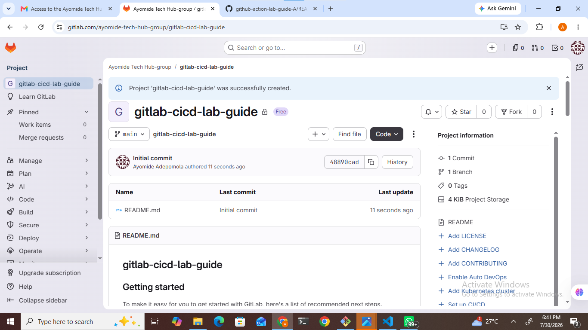


# Step 2: Creating the GitLab CI/CD Pipeline Configuration File

## Purpose

After successfully creating and cloning the repository, the next phase of the project involved configuring *GitLab CI/CD* by creating the .`gitlab-ci.yml` file.

The `.gitlab-ci.yml` file is the heart of every GitLab CI/CD pipeline. It contains the instructions that GitLab Runner executes whenever code is pushed to the repository. Without this file, GitLab cannot automate software development workflows.

This configuration file is written in *YAML (YAML Ain't Markup Language)*, a human-readable language commonly used for defining automation pipelines, infrastructure configuration, and cloud deployments.

The primary objective of this stage was to create a simple CI/CD pipeline capable of automatically executing predefined jobs whenever changes are committed to the repository.

---

## Procedure

The following activities were carried out:

1. Opened the cloned repository in *Visual Studio Code*.
2. Navigated to the project root directory.
3. Created a new file named:

```text
.gitlab-ci.yml
```

Creating this file at the root of the repository is important because GitLab automatically searches for it whenever a commit is pushed.

---

## Writing the Initial Pipeline

The first pipeline was designed to perform two basic stages:

- Build
- Test

The configuration defined two independent jobs:

- *build_job* – responsible for simulating the software build process.
- *test_job* – responsible for simulating software testing.

Instead of compiling a real application, the pipeline used simple `echo` commands to demonstrate how GitLab executes CI/CD jobs.

Example:

```yaml
stages:
  - build
  - test

build_job:
  stage: build
  script:
    - echo "Building the project..."

test_job:
  stage: test
  script:
    - echo "Running tests..."
```

---

## Why This Step Is Important

This stage introduces the core concept of Continuous Integration.

Whenever developers push code to the repository:

- GitLab detects the new commit.
- GitLab reads the `.gitlab-ci.yml` file.
- GitLab schedules the pipeline.
- GitLab Runner executes each job in the order specified.

This automation eliminates repetitive manual tasks and ensures that every code change is validated before moving to the next stage of development.

---

## Expected Outcome

At the completion of this step:

- The repository contained a valid `.gitlab-ci.yml` configuration file.
- GitLab was capable of detecting the pipeline configuration.
- The repository became ready to execute automated CI/CD pipelines.

---

### Screenshot 4 – GitLab CI/CD Configuration File Created

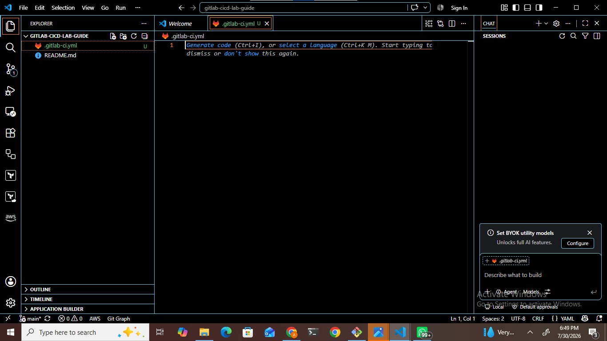

---

# Step 3: Executing the Initial Pipeline

## Purpose

With the pipeline configuration completed, the next objective was to verify that GitLab could successfully interpret the YAML configuration and execute the defined jobs automatically.

Continuous Integration relies on automatically triggering pipelines whenever developers push new code to the repository. This process allows software quality checks to occur without manual intervention.

---

## Procedure

The following steps were performed:

1. Saved the `.gitlab-ci.yml` file.
2. Staged the changes using Git.
3. Created a commit describing the modification.
4. Pushed the commit to the remote GitLab repository.

Example Git commands:

```bash
git add .

git commit -m "Add initial GitLab CI/CD pipeline"

git push origin main
```

Immediately after the push operation completed successfully, GitLab detected the new commit and automatically created a new pipeline.

---

## What Happened Behind the Scenes

Once the push reached GitLab:

- GitLab examined the repository.
- The platform detected the `.gitlab-ci.yml` file.
- The YAML configuration was validated.
- GitLab created a pipeline.
- GitLab Runner began executing each job sequentially.

This entire process occurred automatically without requiring any manual pipeline execution.

---

## Expected Outcome

The pipeline should display a running status while GitLab Runner executes the configured jobs.

Once completed successfully, both the *build* and *test* jobs should display a green *Passed* status.

This confirms that the CI/CD configuration is functioning correctly.

---

### Screenshot 5 – Initial GitLab Pipeline

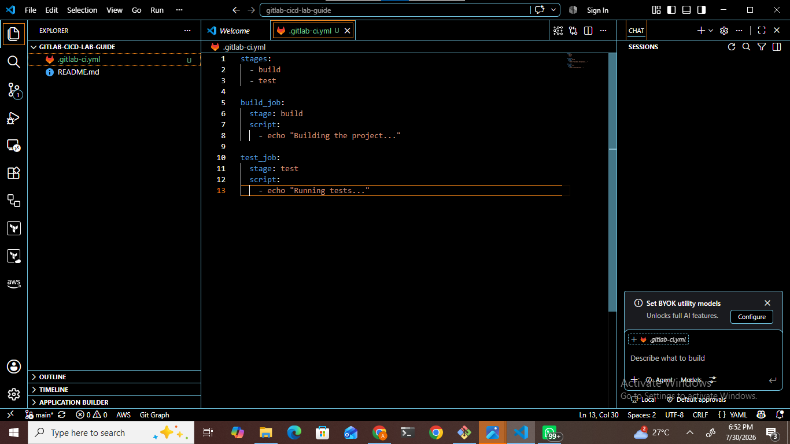

---

### Screenshot 6 – First Pipeline Running

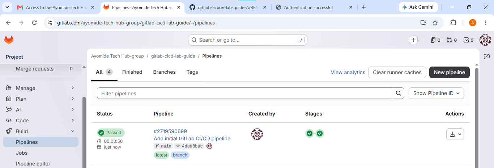

# Step 4: Configuring a Multi-Stage GitLab CI/CD Pipeline

## Purpose

After successfully executing the initial pipeline, the next objective was to enhance the CI/CD workflow by introducing multiple pipeline stages.

In real-world DevOps environments, software delivery consists of several sequential processes rather than a single task. A typical software delivery pipeline includes building the application, executing automated tests, and deploying the application to a target environment.

To simulate an industry-standard workflow, the pipeline was expanded to include three independent stages:

- *Build* – prepares the application for deployment.
- *Test* – validates the application's functionality.
- *Deploy* – simulates releasing the application.

Each stage contains one or more jobs, and GitLab executes these stages sequentially according to the order defined in the `.gitlab-ci.yml` file.

---

## Why Multiple Jobs Are Important

Using multiple jobs provides several benefits:

- Separates responsibilities within the pipeline.
- Makes troubleshooting easier because failures occur in isolated stages.
- Prevents deployment if earlier stages fail.
- Improves pipeline readability and maintainability.
- Reflects industry-standard CI/CD practices.

This layered approach ensures that only verified code progresses through the deployment lifecycle.

---

## Procedure

The `.gitlab-ci.yml` configuration file was updated to define three stages:

```yaml
stages:
  - build
  - test
  - deploy
  ```


Three corresponding jobs were then configured:

- `build_job`
- `test_job`
- `deploy_job`

Each job contained simple `echo` commands to simulate execution while demonstrating how GitLab orchestrates multiple stages.

---

## Pipeline Execution Flow

The updated workflow follows this sequence:

```
Developer Pushes Code
        │
        ▼
 GitLab Detects Commit
        │
        ▼
 Build Stage Executes
        │
        ▼
 Test Stage Executes
        │
        ▼
 Deploy Stage Executes
        │
        ▼
 Pipeline Completes Successfully
```

GitLab automatically ensures that each stage finishes successfully before proceeding to the next stage.

---

## Expected Outcome

A successful execution displays three completed jobs:

- ✅ Build
- ✅ Test
- ✅ Deploy

Each job should display a *Passed* status in the GitLab Pipeline dashboard.

This demonstrates that GitLab correctly interpreted the pipeline configuration and executed every stage in sequence.

---

### Screenshot 7 – Multiple Jobs Pipeline

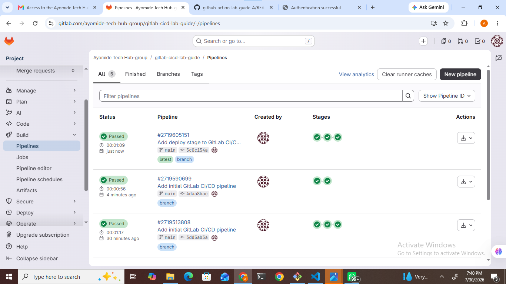

---

### Screenshot 10 – Multiple Jobs Successfully Executed

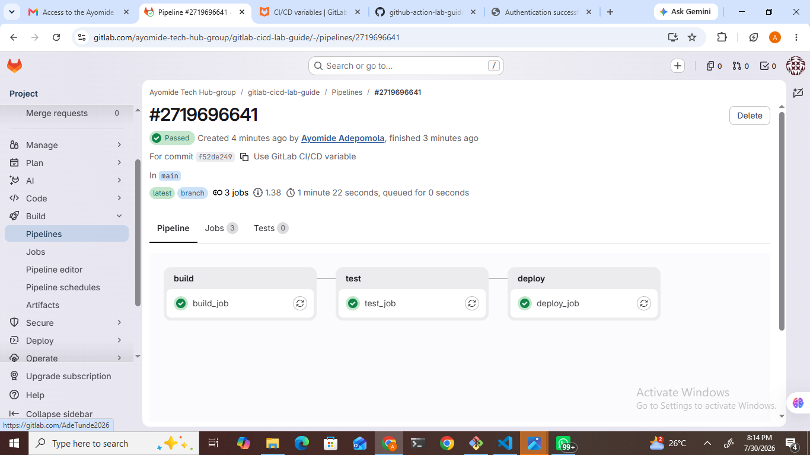

---

# Step 5: Securing the Pipeline Using GitLab CI/CD Variables

## Purpose

Modern CI/CD pipelines frequently require sensitive information such as:

- API Keys
- Database Passwords
- Authentication Tokens
- SSH Private Keys
- Cloud Credentials

Hardcoding these values directly into source code is considered a serious security risk because anyone with repository access could view confidential information.

GitLab addresses this challenge by providing *CI/CD Variables*, which securely store sensitive data outside the repository. During pipeline execution, GitLab injects these variables into the running job without exposing their actual values in the source code.

This approach aligns with DevSecOps principles by protecting confidential information while allowing pipelines to access required credentials securely.

---

## Creating a GitLab CI/CD Variable

To demonstrate secure secret management, a new pipeline variable was created within the project settings.

The following actions were performed:

1. Navigated to *Settings*.
2. Selected *CI/CD*.
3. Opened the *Variables* section.
4. Clicked *Add Variable*.
5. Configured the variable with an appropriate key and value.
6. Saved the variable for pipeline use.

> *Security Note:* The actual value of the variable was masked and has intentionally been omitted from this documentation to follow security best practices.

---

### Screenshot 8 – GitLab Variable Created

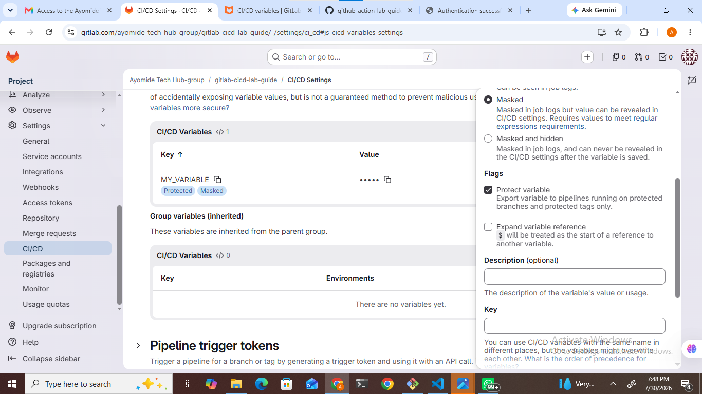

---

### Screenshot 9 – GitLab Variable Configured

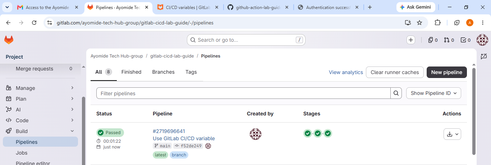

---

### Screenshot 11 – Additional GitLab Variable

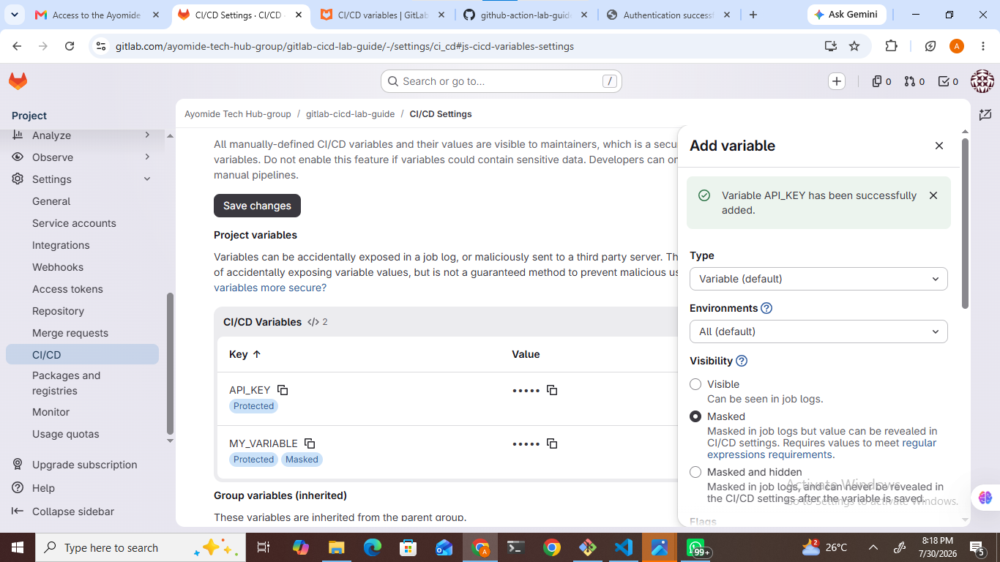

# Using GitLab CI/CD Variables Within the Pipeline

## Purpose

After securely creating the CI/CD variable, the next objective was to integrate it into the pipeline workflow.

GitLab CI/CD variables become available as environment variables during job execution. This enables pipelines to access sensitive information securely without storing confidential data inside the repository.

Using variables improves security by separating configuration from application code and ensures that credentials remain protected throughout the software development lifecycle.

---

## Procedure

The `.gitlab-ci.yml` configuration file was updated to reference the previously created variable.

An additional command was included inside the deployment stage to demonstrate how GitLab automatically injects the variable into the running environment.

Example:

```yaml
deploy_job:
  stage: deploy
  script:
    - echo "Deploying the project..."
    - echo "Using API Key: ${API_KEY}"
```

During pipeline execution, GitLab replaces `${API_KEY}` with the stored variable value.

For security reasons, the actual value remains hidden and is never stored inside the repository.

---

## Why This Is Important

Storing secrets inside source code creates significant security risks.

Using GitLab CI/CD Variables provides several advantages:

- Protects sensitive credentials.
- Prevents accidental exposure in public repositories.
- Simplifies environment configuration.
- Supports different values for development, testing, and production environments.
- Encourages secure DevOps practices.

This approach follows the principle of *separating configuration from source code*, which is widely adopted in modern DevOps workflows.

---

## Expected Outcome

After committing and pushing the updated configuration:

- GitLab automatically triggered a new pipeline.
- The deployment stage accessed the configured variable.
- The variable remained protected throughout pipeline execution.
- The pipeline completed successfully without exposing confidential information.

---

### Screenshot 12 – Variable Added to the Pipeline

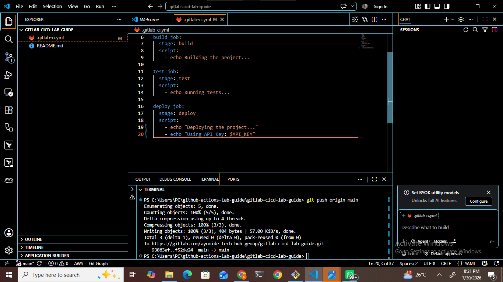

---

### Screenshot 13 – Pipeline Executed Using the Variable

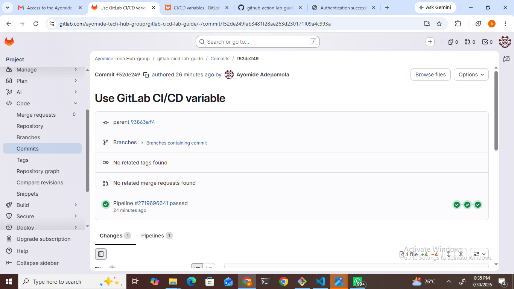

---

### Screenshot 14 – Successful Secure Variable Execution

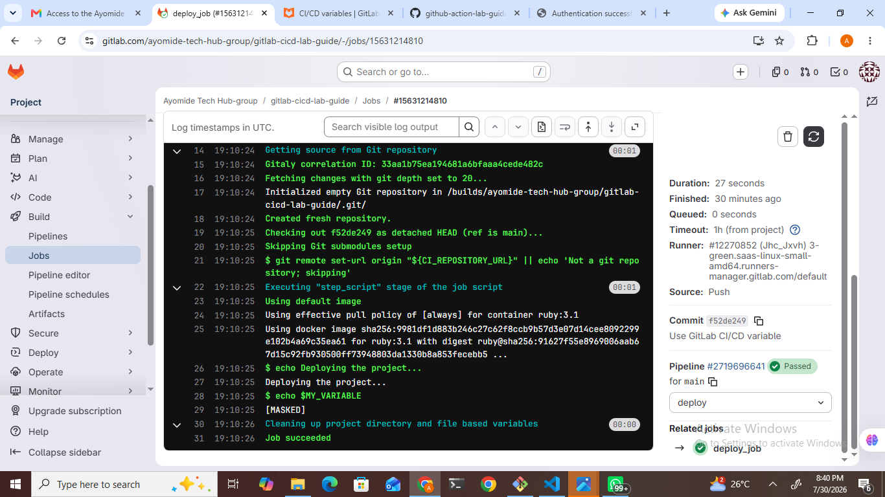

---

# Step 6: Defining GitLab Artifacts

## Purpose

Software build processes often generate important files such as compiled applications, reports, logs, documentation, or packaged releases.

Instead of recreating these files in every stage, GitLab provides *Artifacts*, allowing files produced during one job to be preserved and shared with subsequent jobs.

Artifacts improve efficiency by ensuring that later stages reuse previously generated outputs rather than rebuilding them.

---

## Understanding GitLab Artifacts

Artifacts are files or directories generated during pipeline execution and stored temporarily by GitLab.

Typical examples include:

- Compiled binaries
- Build reports
- Log files
- Test reports
- Deployment packages
- Documentation

In this project, a simple text file was generated to demonstrate how artifacts are created and passed between jobs.

---

## Procedure

The pipeline configuration was updated by adding an artifacts section to the build stage.

Example:

```yaml
artifacts:
  paths:
    - dist/
```

The build stage created a directory named `dist` and generated an output file inside it.

Subsequent jobs declared a dependency on the build stage, allowing them to access the generated artifact.

---

## Why Artifacts Are Important

Artifacts provide several advantages:

- Prevent unnecessary rebuilding.
- Reduce execution time.
- Improve pipeline efficiency.
- Enable file sharing between jobs.
- Preserve important outputs for later inspection.

This demonstrates one of GitLab CI/CD's most valuable features for real-world software delivery pipelines.

---

## Expected Outcome

Following the pipeline execution:

- The build stage generated the required files.
- GitLab preserved the generated files as artifacts.
- The test and deployment stages successfully accessed the artifact.
- The pipeline completed successfully without recreating the files.

---

### Screenshot 15 – Artifacts Added to the Pipeline

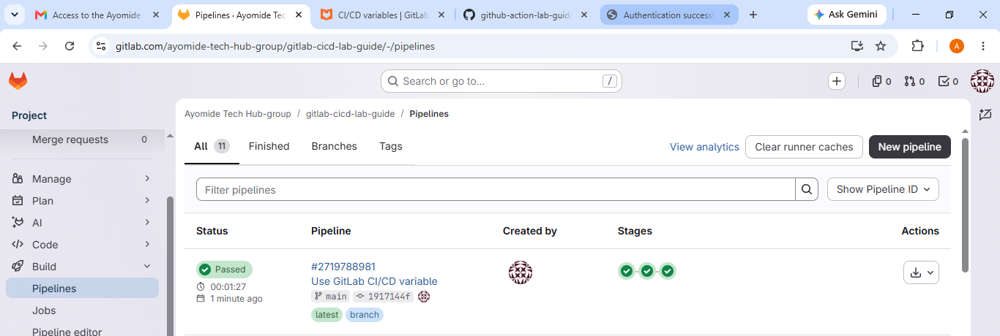

---

### Screenshot 16 – Final Successful Pipeline

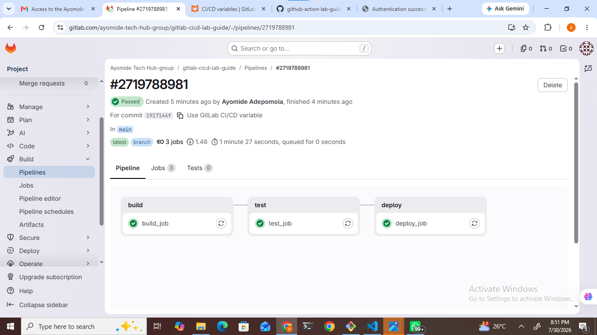

---

### Screenshot 17 – Clean Working Directory

Before concluding the project, the repository status was verified using Git.

Executing the command below confirmed that all project files had been committed and synchronized with the remote repository.

```bash
git status
```

The output indicated that there were no pending changes, confirming that the repository was in a clean state and ready for collaboration or future development.

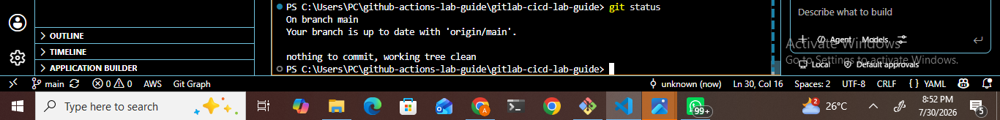

# Key Learning Outcomes

The successful completion of this GitLab CI/CD project provided valuable hands-on experience in implementing modern DevOps practices. Beyond simply following laboratory instructions, this project reinforced the importance of automation, version control, secure software delivery, and infrastructure as code.

The following knowledge and practical skills were acquired during this project:

- Understood the core concepts of Continuous Integration (CI) and Continuous Deployment (CD).
- Successfully created and managed GitLab repositories.
- Configured GitLab CI/CD pipelines using the `.gitlab-ci.yml` configuration file.
- Learned how GitLab automatically detects repository changes and executes pipelines.
- Implemented multi-stage pipelines consisting of Build, Test, and Deploy stages.
- Managed secure environment variables using GitLab CI/CD Variables.
- Applied DevSecOps principles by protecting sensitive information instead of hardcoding credentials.
- Generated and shared artifacts between multiple jobs.
- Monitored pipeline execution using the GitLab Pipeline dashboard.
- Diagnosed and resolved YAML configuration and pipeline validation errors.
- Strengthened Git version control skills through regular commits, pushes, and repository synchronization.
- Improved technical documentation skills by preparing professional Markdown documentation.

These practical experiences provide a strong foundation for implementing CI/CD pipelines in enterprise software development environments.

---

# Challenges Encountered

Throughout the implementation of this project, several technical challenges were encountered. Each challenge provided an opportunity to strengthen troubleshooting skills and gain a deeper understanding of GitLab CI/CD.

## 1. YAML Configuration Errors

During the initial pipeline configuration, several YAML syntax and indentation errors prevented GitLab from validating the pipeline configuration.

*Resolution*

The `.gitlab-ci.yml` file was carefully reviewed and corrected to ensure proper indentation, valid syntax, and accurate job definitions.

---

## 2. Pipeline Validation Errors

Some pipeline executions failed because of incorrect job configuration and script formatting.

*Resolution*

The pipeline configuration was modified according to GitLab's YAML specification until the pipeline executed successfully.

---

## 3. Secure Variable Management

Initially, CI/CD variables were displayed without considering security implications.

*Resolution*

Sensitive values were protected and excluded from screenshots and project documentation in accordance with DevOps security best practices.

---

## 4. Pipeline Debugging

Several pipeline executions failed during testing.

*Resolution*

GitLab pipeline logs were carefully examined to identify configuration issues, allowing the errors to be corrected before rerunning the pipeline.

---

# Best Practices Followed

The following industry best practices were implemented throughout this project:

- Repository documentation was maintained using Markdown.
- CI/CD configuration files were stored under version control.
- Sensitive information was never hardcoded into the repository.
- GitLab Variables were used to securely manage configuration values.
- Build outputs were preserved using Artifacts.
- Multiple pipeline stages were separated according to their responsibilities.
- Frequent commits were made to maintain an organized project history.
- Pipeline execution was validated after each significant modification.
- Official GitLab documentation was consulted whenever configuration issues were encountered.

Following these practices improves maintainability, enhances security, and promotes reliable software delivery.

---

# Conclusion

This project successfully demonstrated the implementation of GitLab Continuous Integration and Continuous Deployment (CI/CD) using Visual Studio Code.

Beginning with repository creation, the project progressed through pipeline configuration, automated job execution, secure variable management, artifact generation, and pipeline validation.

The implementation illustrates how GitLab automates repetitive development tasks while improving software quality, consistency, and deployment reliability.

Beyond completing the laboratory requirements, this project provided practical exposure to modern DevOps workflows and reinforced the importance of automation, security, collaboration, and continuous improvement in software engineering.

The knowledge gained from this project establishes a strong foundation for implementing more advanced CI/CD pipelines involving automated testing, containerization, cloud deployment, Infrastructure as Code (IaC), Kubernetes, and enterprise DevOps practices.

---

# References

The following official resources were consulted during the implementation of this project:

- [GitLab CI/CD Documentation](https://docs.gitlab.com/ee/ci/)
- [GitLab CI/CD YAML Configuration Reference](https://docs.gitlab.com/ee/ci/yaml/)
- [GitLab CI/CD Variables Documentation](https://docs.gitlab.com/ee/ci/variables/)
- [GitLab Job Artifacts Documentation](https://docs.gitlab.com/ee/ci/jobs/job_artifacts/)
- [GitLab Pipelines Documentation](https://docs.gitlab.com/ee/ci/pipelines/)
- [GitLab Runners Documentation](https://docs.gitlab.com/runner/)
- [Git Documentation](https://git-scm.com/doc)
- [Git Clone Documentation](https://git-scm.com/docs/git-clone)
- [Git Commit Documentation](https://git-scm.com/docs/git-commit)
- [Git Push Documentation](https://git-scm.com/docs/git-push)
- [Visual Studio Code Documentation](https://code.visualstudio.com/docs)
- [YAML Official Documentation](https://yaml.org/spec/)
- [DevOps Research and Assessment (DORA)](https://dora.dev/)
---

# Author

*Adepomola Ayomide*
